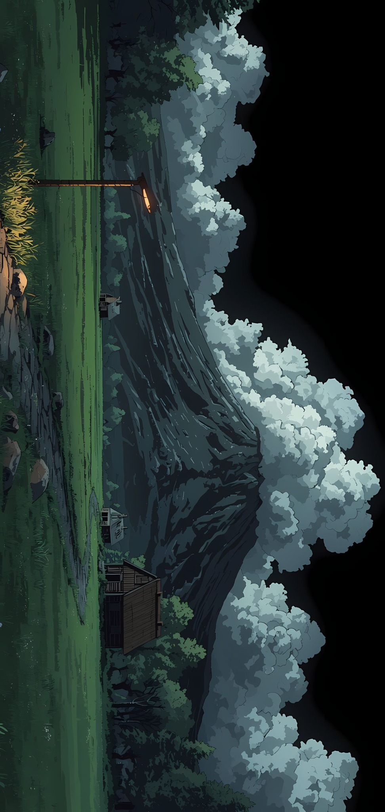

 

  <samp>building • learning • debugging • repeating 👾</samp>

  
  
  
  
  

<table>
<tr>
<td width="68%" valign="top">

🧑‍💻 About Me

I'm Krishna, a final-year BCA student who enjoys turning ideas into things people can actually use.

I started with a strong interest in frontend development and I'm gradually going deeper into backend and full-stack development. Along the way, I'm also sharpening my problem-solving skills with DSA.

🎓 Final-year BCA student
🌐 Web & Full-Stack Development
⚛️ React + JavaScript
🟢 Node.js + Express
🍃 MongoDB
🧩 DSA & problem solving
🎨 UI-focused developer

</td>
<td width="32%" align="right" valign="middle">

</td>
</tr>
</table>

✦ What I'm Working On

<table>
<tr>
<td width="50%">

Currently learning

→ Backend development
→ Full-stack architecture
→ Better database design
→ Writing cleaner JavaScript

</td>
<td width="50%">

Currently improving

→ React & modern frontend patterns
→ DSA problem solving
→ UI/UX thinking
→ Building polished projects

</td>
</tr>
</table>

🛠️ Languages & Tools

  

  

  

  

🧩 Problem Solving

🚀 Projects

  

<samp>More projects are on the way — I'm building them one commit at a time.</samp>

☕ A little corner of the internet

  

<samp>Thanks for stopping by. Keep building cool things. 👾</samp>

  

